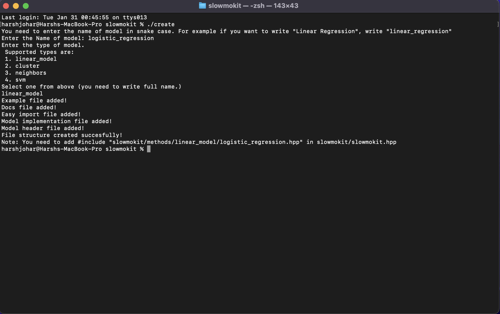

# Create Model

This script creates all the required configuration files for adding a new model in the library.

## Usage example 

__Note:__ The executable might not have the required permissions to run in your device.

To do that, give the execute permission to the file according to your operating system. For UNIX based systems, you can use the `chmod` command.

If this script does not work, then you need to manually add the files at the correct directory structres.